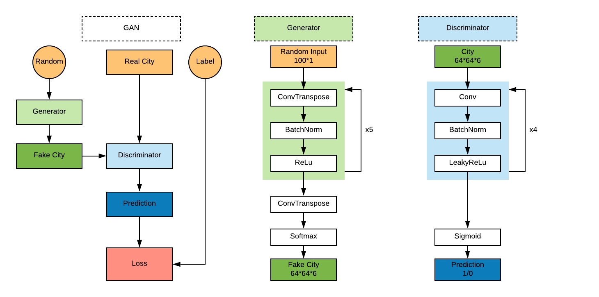
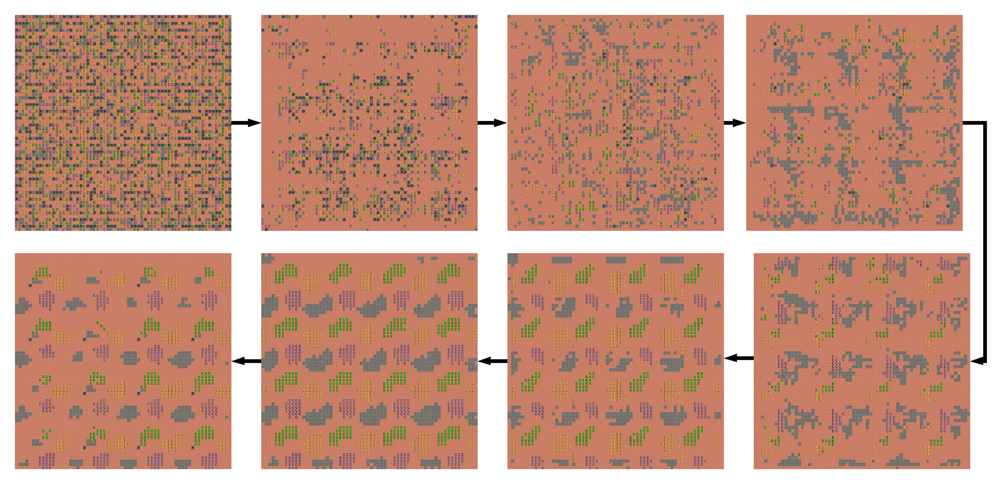
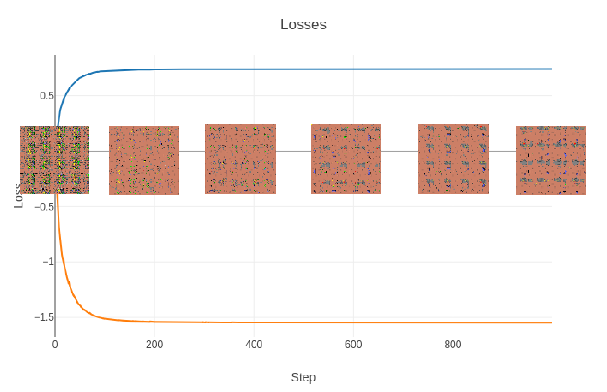

# Micropolis GAN

This  project is training a DCGAN [[1]](https://arxiv.org/abs/1511.06434) in order to generate cities for the Micropolis game [[2]]( https://en.wikipedia.org/wiki/SimCity_(1989_video_game)#Micropolis) based on cities created by players. This is an interesting topic because the agencement of the blocks have a lot of constraints to follow to be a valid city. Firstly, at the building level where squared of blocks on the same type to have a proper building, at the local level because the building has to be connected together by a road if they are not directly side by side and finally at the global where there is way more complicated logic to follow. The final goal is to compare this generative network with a genetic algorithm we implemented in that project [[3]](https://github.com/Etienne-Meunier/Micropolis_GA) on Micropolis.

In order to focus uniquely on the structure of the city in a first time we focused on a small set of essential buildings and remove the time factor by creating the city at once at the start of the game and then we measure the evolution of the city later to have metrics. The first goal was mainly to have cities that visually respected the standards to see if the network was able to get the structure properly.

We were able to build those two projects thanks to the open source version of Micropolis [[5]]() and the work of Smearl that implemented interfaces in python [[6]]()

## Dataset

We feed the network with ``.npy`` files containing encoded version of a city, each tile on the city image is represented by an index according to its type : 

| Tile type         | Index |
| ----------------- | ----- |
| Land              | 0     |
| Rubble            | 0     |
| Road              | 1     |
| NuclearPowerPlant | 2     |
| Residential       | 3     |
| Commercial        | 4     |
| Industrial        | 5     |

Note that a for example Residential Area have to be square of 4 residential tiles to be valid in the game, so this dataset is not conserving the structure of the building because we wanted to give the network the freedom to find it. 

Because we didn't have a lot of cities built by the players and not enough time/skills to build a lot of cities we used the one generated by our genetic algorithm [[3]](https://github.com/Etienne-Meunier/Micropolis_GA), this is a point that could be improved in the future. 

## Network Structure

For the network structure we used the paper [[1]](https://arxiv.org/abs/1511.06434) and for the training the advice they gave in the publication that is detailed more in depth here [[4]](https://medium.com/@utk.is.here/keep-calm-and-train-a-gan-pitfalls-and-tips-on-training-generative-adversarial-networks-edd529764aa9).



In order to come to that result we tried different designs and input methods but also experimented GANs on other datasets to find the right structure, you can find all those trials in the GANS part of the repo [Learning Pytorch](Link) designed to store tentative and the lessons learned. 

## Code Structure

We used Pytorch to implement the network and visdom to visualize the training with time. There is a part of the code that reconstruct the image of the city from the generated matrix for a nicer visualisation, in this code we didn't simulate the city in Micropolis as we did in our other project. 

## Results

This an example of the evolution of the generated city from the same noise through training, you can see that the blocks get their structure with time, that show that the network is able to catch the structure of the buildings. 






In this video you have an accelerated view of the training process : 


## How to use

### Train using a new Dataset

In order to train your own city generator, you can build your dataset as the matrix, you only have to follow the index described above for the visualisation  but it will not impact the training. You then go to the settings and change ``image size`` , ``data root`` and the number of classes ``nc`` if necessary. You can then simply run the training by calling `MicroGan.py`. It will save the progress in a `models` directory automatically.

Because the visualisation is done of Visdom you have to run a Visdom server, you can modify the server directly in setting `viz`or set it to `None` if you don't want a visualization.

### Generate new city

```python
from MicroGan import MicroGan
from settings import *
microgan = MicroGan()
# You can load here your previous model using the .tar you generated
noise = torch.randn(b_size, nz, 1, 1, device=microgan.device)
gen = microgan.netG(noise)
```

## Sources

[1 ] Radford, A., Metz, L., & Chintala, S. (2015). Unsupervised representation learning with deep convolutional generative adversarial networks. *arXiv preprint arXiv:1511.06434*.

[2] *SimCity (1989 video game)*. (2017). *En.wikipedia.org*. Retrieved 31 August 2019, from https://en.wikipedia.org/wiki/SimCity_(1989_video_game)#Micropolis

[3] https://github.com/Etienne-Meunier/Micropolis_GA

[4] Utkarsh Desai -  *Keep Calm and train a GAN. Pitfalls and Tips on training Generative Adversarial Networks*. (2018). *Medium*. Retrieved 31 August 2019, from https://medium.com/@utk.is.here/keep-calm-and-train-a-gan-pitfalls-and-tips-on-training-generative-adversarial-networks-edd529764aa9 

[5] *SimHacker/micropolis*. (2019). *GitHub*. Retrieved 1 September 2019, from https://github.com/simhacker/micropolis

[6] *smearle/micropolis-4bots*. (2019). *GitHub*. Retrieved 1 September 2019, from https://github.com/smearle/micropolis-4botsg